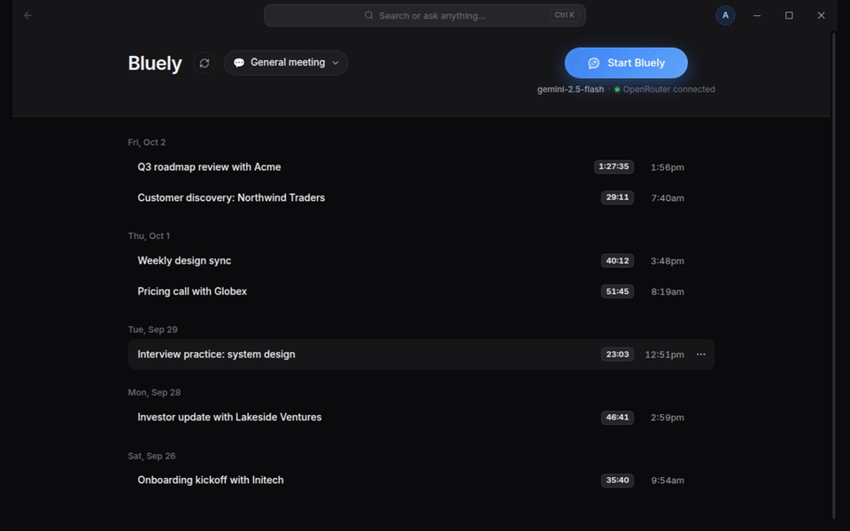
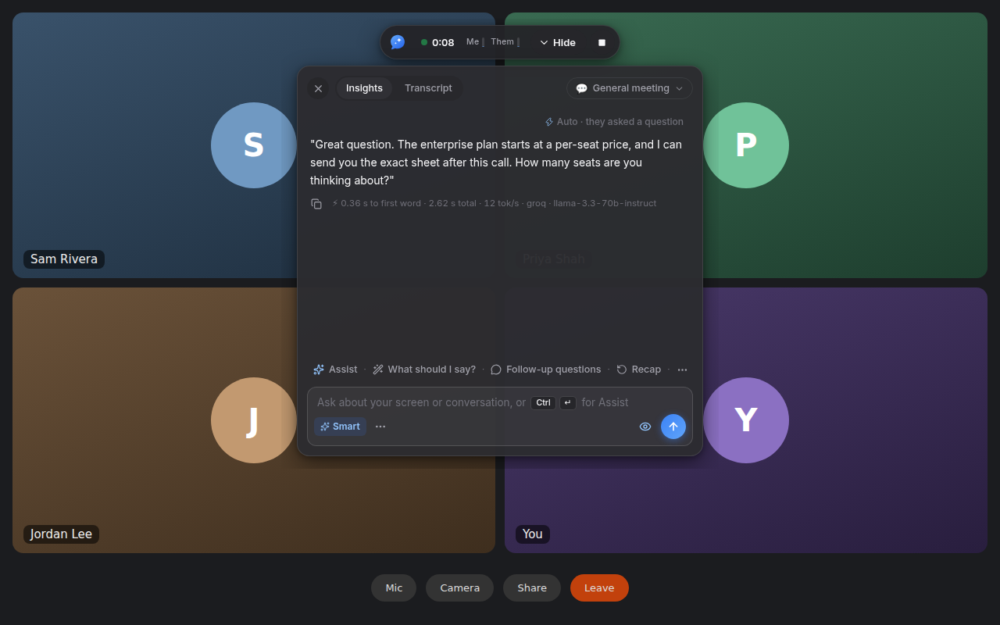
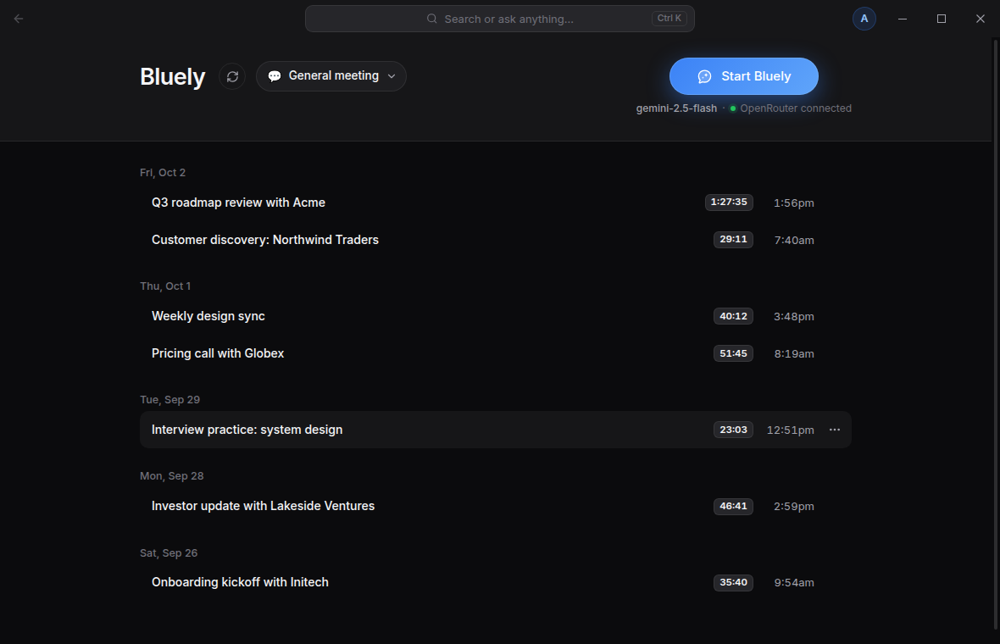
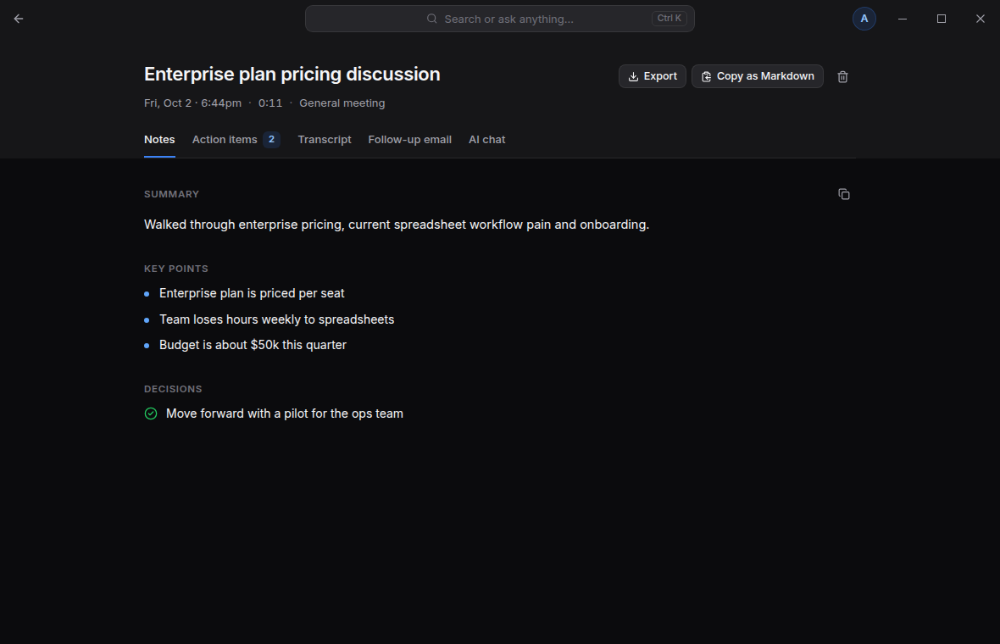
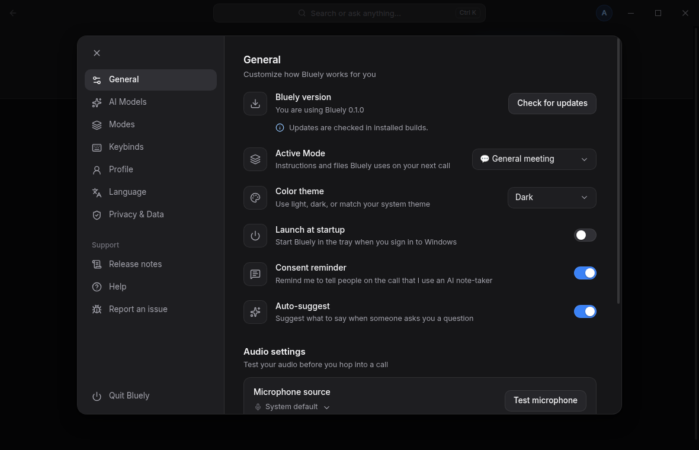

<p align="center">
  
</p>

<h1 align="center">Bluely</h1>

<p align="center">
  <b>Open-source AI meeting copilot for Windows.</b><br />
  Live transcript, what-to-say-next suggestions, notes and follow-ups.<br />
  An open-source Cluely alternative powered by OpenRouter.
</p>

<p align="center">
  <a href="LICENSE"></a>
  <a href="https://github.com/nakib-abrar/bluely/actions/workflows/ci.yml"></a>
  <a href="https://github.com/nakib-abrar/bluely/releases/latest"></a>
</p>

<p align="center">
  
</p>

> **Bluely is not affiliated with or endorsed by Cluely.** It is an independent, MIT-licensed
> project.

While you are on a call (Zoom, Google Meet, Microsoft Teams, Slack huddles, or anything else
that plays audio on your PC), Bluely transcribes both sides, notices when the other person asks
you something, and suggests what to say next in a small always-on-top overlay. After the call it
writes notes, action items and a follow-up email, and keeps everything in a searchable history on
your own computer. There is no Bluely server and no account: you bring your own
[OpenRouter](https://openrouter.ai) API key.

## Contents

- [Features](#features)
- [Screenshots](#screenshots)
- [Install](#install)
- [Get an OpenRouter key](#get-an-openrouter-key)
- [First run](#first-run)
- [Keybinds](#keybinds)
- [Privacy](#privacy)
- [Visible by design](#visible-by-design)
- [Models](#models)
- [Develop](#develop)
- [Architecture](#architecture)
- [Roadmap](#roadmap)
- [Contributing](#contributing) · [Disclaimer](#disclaimer) · [License](#license)

## Features

- **Live transcript, both sides.** Your microphone is labelled **Me**; the call audio coming out
  of your speakers or headset (Windows desktop loopback) is labelled **Them**. No virtual audio
  driver and no meeting bot.
- **Auto-suggest when they ask a question.** When a "Them" line looks like a question, Bluely
  streams a suggested answer into the overlay (label: _Auto · they asked a question_). Toggle it
  per session or per Mode.
- **One-click actions:** _What should I say?_, _Follow-up questions_, _Fact check_, _Who am I
  talking to?_, _Recap_ and _Assist_.
- **Ask, with your screen if you want.** Type any question into the overlay. _Assist_ (or the
  _Include screen_ toggle) attaches a screenshot of your screen for the vision model; answers that
  used it are marked _Viewed screen_.
- **Modes + knowledge files.** Starter Modes (General meeting, Sales call, Client discovery, Job
  interview prep & practice, Team standup, Investor pitch) set instructions and tone. Attach PDF,
  DOCX, TXT or Markdown files (up to 20 MB each, 50 per Mode); Bluely extracts the text and pulls
  the most relevant passages into each prompt.
- **After the call:** notes (summary, key points, decisions), action items with owners and due
  dates, and a follow-up email draft you can edit, copy, open in your mail app or export as
  Markdown.
- **Searchable history + ask across meetings.** Full-text search (with typo tolerance) over titles,
  transcripts, notes, action items and emails, or ask a question and get an answer that cites the
  meetings it came from.
- **Speed you can see.** Every answer shows time to first word, total time, tokens per second,
  provider and model. Settings › AI Models has a latency test to pick the fastest model for you.
- **Local-first.** Your history lives in `%APPDATA%\Bluely` on your PC. Network calls go only to
  OpenRouter (AI) and GitHub (update checks). No telemetry, no accounts, no Bluely server.

## Screenshots

| Overlay during a call | History |
| --- | --- |
|  |  |
| **Notes after the call** | **Settings** |
|  |  |

Screenshots are generated from the real app against a local mock of the OpenRouter API
(`BLUELY_SCREENSHOTS=1 pnpm exec playwright test tests/e2e/screenshots.spec.ts`); the call in the
background is a generic placeholder.

## Install

Bluely runs on **Windows 10 and 11 (x64)**.

1. Open the [latest release](https://github.com/nakib-abrar/bluely/releases/latest) and download
   one of:
   - **`Bluely-Setup-<version>.exe`**: installer (recommended). It first asks who to install for:
     **only for me** (the default; no admin rights needed, installs to
     `%LOCALAPPDATA%\Programs\Bluely`) or **anyone who uses this computer** (asks for admin
     rights, installs to `Program Files`). It lets you choose the folder, adds Start menu and
     desktop shortcuts, and **auto-updates**: it checks GitHub Releases for new versions, downloads
     one when you click _Download_, and installs it on _Restart to update_ (or the next time you
     quit).
   - **`Bluely-<version>-portable.exe`**: single file, nothing installed. Portable builds do
     **not** auto-update; download a new release to upgrade. _Launch at startup_ registers this
     exe where it is (start it once from its new folder after moving it), so turn it off before
     you delete the file.
2. **Windows SmartScreen.** Bluely's builds are not code-signed yet (a certificate costs money the
   project does not have), so Windows shows _"Windows protected your PC"_ the first time. Click
   **More info → Run anyway**. Only do this for files downloaded from the official Releases page.
3. **Optional: verify the download.** Each release has a `SHA256SUMS.txt`. In PowerShell:

   ```powershell
   Get-FileHash .\Bluely-Setup-0.1.0.exe -Algorithm SHA256
   ```

   The hash must match the line for that file in `SHA256SUMS.txt`.

Uninstalling (Windows Settings › Apps) removes the program and its _Launch at startup_ entry but
keeps your data in `%APPDATA%\Bluely`. **Settings › Privacy & Data › Delete all data** removes your
sessions (transcripts, notes, action items, AI answers), knowledge files, custom Modes, saved
screenshots and usage statistics, but keeps your settings and profile, the encrypted API key, the
logs and the cached list of OpenRouter models. To remove everything, delete the `%APPDATA%\Bluely`
folder after uninstalling.

## Get an OpenRouter key

Bluely uses [OpenRouter](https://openrouter.ai) for both the AI answers and speech-to-text, so one
key covers everything.

1. Sign in at [openrouter.ai](https://openrouter.ai) and create a key at
   **[openrouter.ai/keys](https://openrouter.ai/keys)**.
2. Add credits at [openrouter.ai/settings/credits](https://openrouter.ai/settings/credits).
   You pay OpenRouter directly for what you use; Bluely shows the cost of each request and your
   monthly spend.
3. Paste the key in the onboarding screen or in **Settings › AI Models**, then click **Test
   connection** (shows the key's label, limit and remaining credit).

The key is encrypted with Windows DPAPI (Electron `safeStorage`) and stored in
`%APPDATA%\Bluely\openrouter-key.bin`. It never leaves the main process: the UI only ever sees a
masked form such as `sk-or-…9f3c`.

## First run

Bluely opens a three-step onboarding the first time:

1. **Connect your OpenRouter key**: paste your key and click **Test connection** (or skip and add
   it later in Settings › AI Models).
2. **Check your audio**: pick your microphone, click **Test microphone** (Bluely records 5 seconds
   and shows what it transcribed) and **Test system audio** (play a video or music first). The
   same step shows the Ask shortcut, <kbd>Ctrl</kbd>+<kbd>Enter</kbd>, with a one-click switch to
   <kbd>Alt</kbd>+<kbd>Enter</kbd> for chat apps that send messages with Ctrl+Enter. Use
   headphones on calls so your speakers do not leak into the microphone.
3. **Pick a Mode**: choose what kind of call it is, optionally add files for that Mode (product
   sheets, pricing, your CV) and your name. Then click **Start Bluely** to start a session right
   away, or **Finish setup**.

Start a session from the main window, the tray icon or the overlay. Stop it with
<kbd>Ctrl</kbd>+<kbd>Shift</kbd>+<kbd>&#92;</kbd> and Bluely writes the notes.

## Keybinds

All keybinds can be changed in **Settings › Keybinds** (conflicts are detected there).

| Action                                                     | Default                                                                                     | Works                         |
| ---------------------------------------------------------- | ------------------------------------------------------------------------------------------- | ----------------------------- |
| Show / hide Bluely (overlay)                               | <kbd>Ctrl</kbd>+<kbd>&#92;</kbd>                                                            | Everywhere                    |
| Ask Bluely / Assist                                        | <kbd>Ctrl</kbd>+<kbd>Enter</kbd> (one-click preset: <kbd>Alt</kbd>+<kbd>Enter</kbd>)        | Everywhere                    |
| Stop session                                               | <kbd>Ctrl</kbd>+<kbd>Shift</kbd>+<kbd>&#92;</kbd>                                           | Everywhere                    |
| Move the overlay 10 px / 50 px                             | <kbd>Ctrl</kbd>+<kbd>↑↓←→</kbd> / <kbd>Ctrl</kbd>+<kbd>Shift</kbd>+<kbd>↑↓←→</kbd>         | Only while the overlay shows  |
| What should I say? · Follow-up questions · Recap           | <kbd>Ctrl</kbd>+<kbd>Shift</kbd>+<kbd>1</kbd> · <kbd>2</kbd> · <kbd>3</kbd>                 | Everywhere                    |
| Clear chat                                                 | <kbd>Ctrl</kbd>+<kbd>R</kbd>                                                                | When the overlay is focused   |
| Scroll chat                                                | <kbd>Ctrl</kbd>+<kbd>Shift</kbd>+<kbd>↑</kbd>/<kbd>↓</kbd>                                  | When the overlay is focused   |
| Latency dev panel                                          | <kbd>Ctrl</kbd>+<kbd>Shift</kbd>+<kbd>D</kbd>                                               | When the overlay is focused   |

If your chat app already sends messages with <kbd>Ctrl</kbd>+<kbd>Enter</kbd>, switch to the
<kbd>Alt</kbd>+<kbd>Enter</kbd> preset in Settings › Keybinds. While the overlay has focus,
<kbd>Ctrl</kbd>+<kbd>Shift</kbd>+<kbd>↑</kbd>/<kbd>↓</kbd> scroll the chat instead of moving the
overlay.

## Privacy

Short version: your meetings stay on your PC, audio is never saved, and the only things that leave
your computer are the requests Bluely makes to OpenRouter on your behalf (plus update checks to
GitHub in installed builds).

- Stored locally in `%APPDATA%\Bluely`: the SQLite database (`bluely.db`) with sessions,
  transcripts, AI answers, notes, Modes, knowledge text and settings; the encrypted API key; logs
  (API keys redacted). Screenshots are saved only if you turn on _Save screenshots with sessions_
  (off by default).
- Sent to OpenRouter: speech segments for transcription (during a session, and the 5-second
  sample when you click _Test microphone_), and prompts containing transcript excerpts, your
  profile, Mode instructions and knowledge snippets. A screenshot is sent only when you use Assist
  or turn on _Include screen_.
- Retention (keep forever, 30, 90 or 365 days), _Export all_ and _Delete all_ are in Settings ›
  Privacy & Data.

Exactly what is stored, where, and what is sent: **[PRIVACY.md](PRIVACY.md)**.

## Visible by design

Bluely is an assistant you use openly, not a tool for hiding things from the people you talk to.

- **No stealth features.** Bluely never hides itself from screen sharing or recording (no content
  protection, no capture exclusion). If you share your screen, people can see the overlay.
- **Always findable.** The main window is always in the taskbar and the tray icon is always
  present while Bluely runs.
- **Consent reminder, on by default.** When a session starts Bluely reminds you to tell the other
  participants, with a one-click disclosure message you can paste into the meeting chat:

  > Heads up: I'm using an AI note-taker (Bluely) to transcribe this call.

Recording or transcribing people may require their consent where you live. You are responsible
for following the law and your organization's policies. Pull requests that add stealth features
will not be accepted (see [CONTRIBUTING.md](CONTRIBUTING.md)).

## Models

All models are called through OpenRouter and can be changed in **Settings › AI Models**.

| Role                       | Default model                       | Routing                                             |
| -------------------------- | ----------------------------------- | --------------------------------------------------- |
| Fast (live suggestions)    | `meta-llama/llama-3.3-70b-instruct` | Providers Groq, then Cerebras; sorted by latency    |
| Smart (Assist, vision)     | `google/gemini-2.5-flash`           | Sorted by latency; reads screenshots                |
| Notes (after the call)     | `anthropic/claude-sonnet-4.5`       | Sorted by price                                     |
| Speech-to-text             | `openai/whisper-large-v3-turbo`     | OpenRouter `/audio/transcriptions`                  |

At startup Bluely checks these against OpenRouter's live model list (`GET /api/v1/models`). If a
model has been retired it falls back to the closest available one from a curated list and tells
you. The overlay's _Fast/Smart_ chip picks the tier for typed questions; Modes can override
models.

## Develop

Requirements: Node.js 22.12+, pnpm 10 (`corepack enable`), Git. Windows is the target platform;
development also works on Linux (desktop audio loopback through PulseAudio/PipeWire).

```bash
pnpm install          # also copies the VAD model/ONNX runtime into src/renderer/public/vad
pnpm dev              # Electron + Vite with hot reload
pnpm test             # unit tests (Vitest, run inside Electron's Node so native modules match)
pnpm test:e2e         # builds, then runs Playwright end-to-end tests against Electron
pnpm typecheck && pnpm lint && pnpm format:check
pnpm dist             # Windows installer + portable exe into release/
```

**Without an OpenRouter key or credits:** run the local mock API and point an unpackaged build at
it (the override is ignored in installed builds):

```bash
pnpm mock:openrouter                                   # listens on http://127.0.0.1:4010
BLUELY_OPENROUTER_BASE_URL=http://127.0.0.1:4010/api/v1 pnpm dev
```

Any `sk-or-…` key works with the mock. On Linux, run E2E tests under Xvfb:
`xvfb-run -a pnpm test:e2e`.

**Check desktop audio capture** for an Electron version with `pnpm verify:loopback` (or
`npx electron@<version> scripts/verify-loopback/main.cjs`); see
[docs/VERIFY_LOOPBACK.md](docs/VERIFY_LOOPBACK.md).

## Architecture

Electron 43.7.7 (pinned exactly, because desktop loopback capture depends on the Electron
version; it passes the loopback verifier in Windows CI with a virtual sound card but has not yet
been verified on a physical Windows 10/11 PC, see
[docs/VERIFY_LOOPBACK.md](docs/VERIFY_LOOPBACK.md)) + electron-vite + TypeScript + React 19 +
Tailwind CSS v4. The main process owns everything privileged: the SQLite database
(better-sqlite3, FTS5 search), the encrypted key, and every network call. The two renderers
(main window and overlay) run sandboxed with context isolation and talk to main only through a
typed, zod-validated IPC contract (`src/shared/ipc.ts`). Audio is captured in the overlay
renderer, cut into speech segments with Silero VAD, and transcribed in main.

Details: **[docs/ARCHITECTURE.md](docs/ARCHITECTURE.md)**. Problems:
**[docs/TROUBLESHOOTING.md](docs/TROUBLESHOOTING.md)**.

## Roadmap

- More providers behind the existing `LLMProvider` / `STTProvider` interfaces: Deepgram and
  AssemblyAI streaming speech-to-text, Groq and Gemini direct, local Whisper.
- Calendar integration and pre-call briefs.
- Continuous screen OCR for context.
- CRM integrations.
- Team features.
- macOS and Linux builds.
- Web search for fact checks.
- Embeddings-based retrieval for knowledge files and history.
- Code signing (no more SmartScreen warning).
- A WASAPI sidecar as a fallback for desktop audio capture, behind the `AudioSource` interface.

## Contributing

Bug reports, ideas and pull requests are welcome. Start with [CONTRIBUTING.md](CONTRIBUTING.md);
please follow the [Code of Conduct](CODE_OF_CONDUCT.md). Report security issues privately as
described in [SECURITY.md](SECURITY.md).

## Disclaimer

Bluely is not affiliated with or endorsed by Cluely. "Cluely" is used only to describe what kind
of tool Bluely is an open-source alternative to. Bluely is not affiliated with OpenRouter or any
model provider either. AI suggestions can be wrong: check facts before you rely on them.

## License

[MIT](LICENSE) © 2026 Bluely contributors.

### GitHub topics

`cluely-alternative` `cluely` `open-source` `ai-meeting-assistant` `meeting-copilot`
`meeting-notes` `ai-notetaker` `live-transcription` `openrouter` `electron` `windows` `llm`
`speech-to-text`
